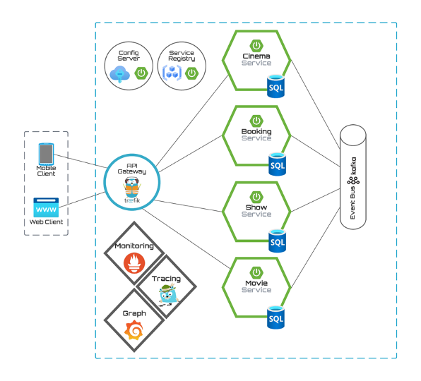

# MicroKino


Mobile Computing 2 Projekt WiSe2022 von Danny Steinbrecher und Christian Harders



## Projekt Struktur
Um die einzelnen Services in IntelliJ direkt aus dem Main-Projekt (MikroKino)  zu benutzen, müssen diese als Modul geladen werden. Dazu muss ein neues Modul in den Projekteinstellungen hinzugefügt werden:


## GitHub Action Workflow

[//]: # (### Environment Variablen)

[//]: # (Um den names des packages an den Workflownamen zu binden, bietet GitHub eigene Environment Variablen an. Mit dem `GITHUB_WORKFLOW` kann der Name, den man dem Workflow gegeben hat, als Packagename benutzt werden. )

[//]: # (https://docs.github.com/en/actions/learn-github-actions/environment-variables)


### Semgrep - Code Smell Check
https://github.com/marketplace/actions/semgrep-action

```yaml
  semgrep:
    name: Scan
    runs-on: ubuntu-20.04
    container:
      image: returntocorp/semgrep
    steps:
    - uses: actions/checkout@v3
    - run: semgrep ci
 ```


## Pull Package von GitHub Registry
Um das Paackage welches ihr in eure private GitHub Registry deployed habt zu pullen, müsst ihr euch zunächst Authentifizieren. Das erfolgt über den folgenden Befehl

```bash
  docker login ghcr.io
```

Hierbei werden ihr aufgefordert einen Usernamen und ein Passwort einzugeben. Für das Passswort benötigt ihr einen Personal Access Token. Diesen könnt Ihr euch unter eruem Account anlegen.


Danach könnt Ihr das Package pullen:

```bash
  docker pull ghcr.io/<namespace>/<package-name>
```

## Build Prozess
Jeder Service besitzt eine eigene Dockerfile, in der wir ein Multi-Stage-Docker-Image bauen. Hier wird im ersten Schritt der Service mittels Gradle gebaut und anschließend daraus das Docker Image erzeugt.

```dockerfile
# Multi-stage Docker Image Build
FROM gradle:jdk17 as build
WORKDIR /workspace/app

# Copy Gradle Config
COPY build.gradle.kts .
COPY settings.gradle.kts .

# First gradle run without src to pull all dependencies
# Just ignoring errors
RUN gradle build 2>/dev/null || true

# copy source and build again
COPY src src
RUN gradle build

# Final Image that will contain the application created by above build image
FROM openjdk:17

ENV LANGUAGE='en_US:en'

# We make four distinct layers so if there are application changes the library layers can be re-used
COPY --from=build --chown=185 /workspace/app/build/libs/bookingservice-0.0.1-SNAPSHOT.jar bookingservice-0.0.1-SNAPSHOT.jar

#execute the application
ENTRYPOINT ["java","-jar","/bookingservice-0.0.1-SNAPSHOT.jar"]
```

Somit haben wir die Option zwei Docker-Compose Dateien zu bauen: Eine für den Produktions- und Testbetrieb, also das komplette Deployment. Und eine für den (lokalen) Entwicklungsprozess.

### Development
Hier können wir die gesamte Infrastruktur lokal hochfahren, und müssen nicht jede Änderung der Services hochladen und warten, bis die Packages gebaut werden.

```dockerfile

version: "3.8"

services:
  gateway:
    image: "traefik:v2.9"
    ...
    
  movieservice:
    build:
      context: ../movieservice
      dockerfile: ../movieservice/Dockerfile
    image: "fh-erfurt/microkino:movieservice"
    ...
    
  cinemaservice:
    build:
      context: ../cinemaservice
      dockerfile: ../cinemaservice/Dockerfile
    image: "fh-erfurt/microkino:cinemaservice"
    ...
    
  ...
```
### Produktions- und Testbetrieb
Diese Compose Datei nutzt die Packages, welche automatisiert in den GitHub Action Workflows erzeugt werden. Diese wird dann für den Produktions- und Testbetrieb (Deploymentprozess) genutzt.

```dockerfile
version: "3.8"

services:
  gateway:
    image: "traefik:v2.9"
    ...

  movieservice:
    image: ghcr.io/fh-erfurt/microkino:movieservice
    ...
    
  cinemaservice:
    image: ghcr.io/fh-erfurt/microkino:cinemaservice
    ...
 
  ...
```

### GitHub Actions Workflow
In den Workflows muss nun kein eigener Gradle Build implementiert sein. Hier braucht es lediglich den Checkout, das Login in die Container-Registry und im Anschluss das Bauen sowie das Pushen des Docker Images. Ein separater Test Step  ist ebenfalls nicht nötig, da dieser schon beim Build des Services ausgeführt wird. Schlägt dieser fehl, läuft der Workflow nicht durch und gibt die passende Fehlermeldung aus.


```yml
name: "movieservice"

on:
  ...

env:
  ...

defaults:
  ...

jobs:
  build-and-push-image:
    runs-on: ubuntu-latest

    steps:
      - uses: actions/checkout@v3
        ...

      - name: Log in to the Container registry
        ...

      - name: Extract metadata (tags, labels) for Docker
        ...

      - name: Build and push Docker image
        uses: docker/build-push-action@ad44023a93711e3deb337508980b4b5e9bcdc5dc
        with:
          context: ./movieservice/
          file: ./movieservice/Dockerfile
          ...
 ```


## Traefik
.. wird über die docker-compose.yml konfiguriert.
Wir haben für jeden Service einen eigenen Router erstellt<sup>[1]</sup>.
Da Traefik direkt an spezifische Container routen kann, kann jeder Service den selben Port nutzen<sup>[2]</sup> (in unserem Fall in den jeweiligen application.properties konfiguriert, wir nutzen 8090). Weil wir die Ports allerdings nicht exposen - somit keine "ports"-Definition angeben, müssen wir dem jeweiligen Router noch den Port mitteilen<sup>[3]</sup>.
Bei Spring muss zusätzlich beachtet werden, dass der jeweilige Webserver standardmäßig auf 'localhost' gebunden wird. Das funktioniert wiederum mit Docker nicht - die Adresse muss (ebenfalls in application.properties) auf 0.0.0.0<sup>[4]</sup> geändert werden.
```yaml
# Auszug aus docker-compose.yml
myservice:
    image: repo/myImage
    labels:
      - "traefik.enable=true"
      - "traefik.http.routers.myservice.rule=PathPrefix(`/myservice_prefix`)"   # [1]
      - "traefik.http.services.myservice.loadbalancer.server.port=8090"         # [3]
```
[^1]:,[^3]:

```properties
# Auszug Spring Modul application.properties
server.port=8090        # [2]
server.address=0.0.0.0  # [4]
```
