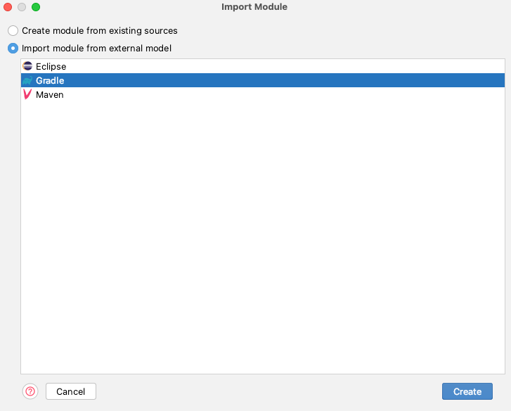
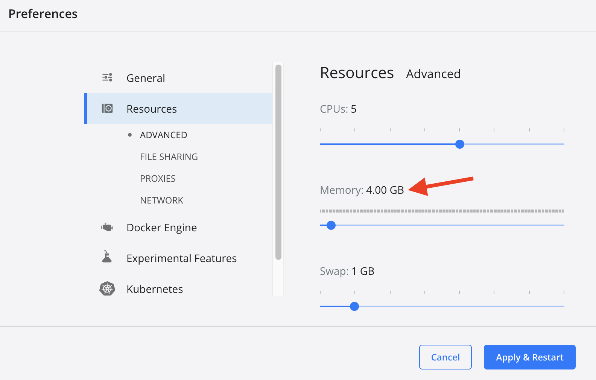

# µKino


 <a href="https://github.com/fh-erfurt/MicroKino-Kubernetes-config" target="_blank">Kubernetes Config für MicroKino</a>

## Projekt Struktur

### Architektur


### Pipeline


### Services in IntelliJ laden

Um die einzelnen Services in IntelliJ direkt aus dem Main-Projekt (MikroKino)  zu benutzen, müssen diese als Modul
geladen werden. Dazu muss ein neues Modul in den Projekteinstellungen hinzugefügt werden:




## Kafka


Wir haben Kafka exemplarisch zwischen Movie und Show implementiert.
Der Endpunkt **/show/details/{showId}** nutzt Kafka-Templates und den Request-Response-Mechanismus, um asynchron
Filmdetails aus dem Movieservice zu erfragen, die anschließend gemeinsam mit den Informationen zur Filmvorstellung
zurückgegeben werden.
[Templates](https://github.com/fh-erfurt/MicroKino/blob/main/showservice/src/main/kotlin/de/fherfurt/showservice/messaging/KafkaConfig.kt#L21-L41 "Templates"),
[Request-Implementierung](https://github.com/fh-erfurt/MicroKino/blob/main/showservice/src/main/kotlin/de/fherfurt/showservice/ShowServiceController.kt#L46-L60 "Request"),
[Response-Implementierung](https://github.com/fh-erfurt/MicroKino/blob/main/movieservice/src/main/kotlin/de/fherfurt/movieservice/messaging/MovieResult.kt#L10-L22 "Response")

### Template

[Showservice]

```kotlin
@Bean
fun replyingKafkaTemplate(
    producerFactory: ProducerFactory<String?, Long>?,
    factory: ConcurrentKafkaListenerContainerFactory<String?, Movie?>
): ReplyingKafkaTemplate<String?, Long, Movie?> {
    val replyContainer: ConcurrentMessageListenerContainer<String?, Movie?> = factory.createContainer(replyTopic)
    replyContainer.containerProperties.isMissingTopicsFatal = false
    replyContainer.containerProperties.setGroupId(groupId!!)
    return ReplyingKafkaTemplate(producerFactory, replyContainer)
}
```

### Request-Implementierung

[Showservice]

```kotlin
@GetMapping("/show/details/{showId}")
fun getObject(@PathVariable(value = "showId") showId: Long): ResponseEntity<String?>? {
    val show = showRepository?.findShowById(showId)
    val movieId = show?.movieId

    val record: ProducerRecord<String?, Long> =
        ProducerRecord(requestTopic, 0, show?.id.toString(), movieId)
    val future: RequestReplyFuture<String?, Long, Movie?> =
        replyingKafkaTemplate!!.sendAndReceive(record)
    val response: ConsumerRecord<String?, Movie?>? = future.get()

    val mapper = ObjectMapper().registerKotlinModule()
    val movie = mapper.readValue<Movie?>(response!!.value().toString())

    return ResponseEntity<String?>(mapper.writeValueAsString(movie) + show, HttpStatus.OK)
}
```

### Response-Implementierung

[Movieservice]

```kotlin
@Component
class MovieResult {
    @Autowired
    val movieRepository: MovieRepository? = null

    @KafkaListener(topics = ["\${kafka.reuest.topic}"], groupId = "\${kafka.group.id}")
    @SendTo
    fun handle(movieId: Long): String? {
        val movie = movieRepository?.findMovieById(movieId)

        val mapper = ObjectMapper()
        return mapper.writeValueAsString(movie)
    }
}
```

### Anmerkung zu Spring REST-Mappings

Uns ist aufgefallen, dass man die Verwendung von Mappings der Struktur

```
    @GetMapping("/show/list")
    fun getAllMovies(): List<Show>? {
        return showRepository?.findAll()?.toList()
    }

    @GetMapping("/show/{showId}")
    fun getShowById(@PathVariable(value = "showId") showId: Long): Show? {
        return showRepository?.findShowById(showId)
    }

    @PostMapping("/show/remove")
    fun removeShow(@RequestBody show: Show) {
        showRepository?.delete(show);
    }
```

vermeiden sollte. Zumindest muss hier die Reihenfolge vertauscht werden. Ruft man hier */show/remove* auf, wird Spring
eine *NumberFormatException* werfen, da es versucht, 'remove' als showId (=Long) zu werten.
Besser wäre, aus '/show/{showId}' einfach '/show/id/{showId}' zu machen, um die Verwechselung zu verhindern.

## Traefik

.. wird über
die [docker-compose.yml](https://github.com/fh-erfurt/MicroKino/blob/main/infrastructure/common_infrastructure.yml#L4-L38)
konfiguriert.
Wir haben für jeden Service einen eigenen Router erstellt<sup>[1]</sup>.
Da Traefik direkt an spezifische Container routen kann, kann jeder Service den selben Port nutzen<sup>[2]</sup> (in
unserem Fall in den jeweiligen application.properties konfiguriert, wir nutzen 8090). Weil wir die Ports allerdings
nicht exposen - somit keine "ports"-Definition angeben, müssen wir dem jeweiligen Router noch den Port
mitteilen<sup>[3]</sup>.
Bei Spring muss zusätzlich beachtet werden, dass der jeweilige Webserver standardmäßig auf 'localhost' gebunden wird.
Das funktioniert wiederum mit Docker nicht - die Adresse muss (ebenfalls in application.properties) auf
0.0.0.0<sup>[4]</sup> geändert werden.

```yaml
# Auszug aus docker-compose.yml
myservice:
  image: repo/myImage
  labels:
    - "traefik.enable=true"
    - "traefik.http.routers.myservice.rule=PathPrefix(`/myservice_prefix`)"   # [1]
    - "traefik.http.services.myservice.loadbalancer.server.port=8090"         # [3]
```

[^1]:,[^3]:

```properties
# Auszug Spring Modul application.properties
server.port=8090        # [2]
server.address=0.0.0.0  # [4]
```

## Continuous Integration

### Build Prozess

Jeder Service besitzt eine eigene Dockerfile, in der wir ein Multi-Stage-Docker-Image bauen. Hier wird im ersten Schritt
der Service mittels Gradle gebaut und anschließend daraus das Docker Image erzeugt.

```dockerfile
# Multi-stage Docker Image Build
FROM gradle:jdk17 as build
WORKDIR /workspace/app

# Copy Gradle Config
COPY build.gradle.kts .
COPY settings.gradle.kts .

# First gradle run without src to pull all dependencies
# Just ignoring errors
RUN gradle build 2>/dev/null || true

# copy source and build again
COPY src src
RUN gradle build

# Final Image that will contain the application created by above build image
FROM openjdk:17

ENV LANGUAGE='en_US:en'

# We make four distinct layers so if there are application changes the library layers can be re-used
COPY --from=build --chown=185 /workspace/app/build/libs/bookingservice-0.0.1-SNAPSHOT.jar bookingservice-0.0.1-SNAPSHOT.jar

#execute the application
ENTRYPOINT ["java","-jar","/bookingservice-0.0.1-SNAPSHOT.jar"]
```

Somit haben wir die Option zwei Docker-Compose Dateien zu bauen: Eine für den Produktions- und Testbetrieb, also das
komplette Deployment. Und eine für den (lokalen) Entwicklungsprozess.

### GitHub Actions Workflow

In den Workflows muss nun kein eigener Gradle Build implementiert sein. Hier braucht es lediglich den Checkout, das
Login in die Container-Registry und im Anschluss das Bauen sowie das Pushen des Docker Images. Ein separater Test Step
ist ebenfalls nicht nötig, da dieser schon beim Build des Services ausgeführt wird. Schlägt dieser fehl, läuft der
Workflow nicht durch und gibt die passende Fehlermeldung aus.

```yml
name: "movieservice"

on:
  ...

env:
  ...

defaults:
  ...

jobs:
  build-and-push-image:
    runs-on: ubuntu-latest

    steps:
      - uses: actions/checkout@v3
        ...

      - name: Log in to the Container registry
        ...

      - name: Extract metadata (tags, labels) for Docker
        ...

      - name: Build and push Docker image
        uses: docker/build-push-action@ad44023a93711e3deb337508980b4b5e9bcdc5dc
        with:
          context: ./movieservice/
          file: ./movieservice/Dockerfile
          ...
```

#### Produktionsbetrieb

Diese Compose Datei nutzt die Packages, welche automatisiert in den GitHub Action Workflows erzeugt werden. Diese wird
dann für den Produktions- und Testbetrieb (Deploymentprozess) genutzt.

```yml
version: "3.8"

services:
  gateway:
    image: "traefik:v2.9"
    ...

  movieservice:
    image: ghcr.io/fh-erfurt/microkino:movieservice
    ...

  cinemaservice:
    image: ghcr.io/fh-erfurt/microkino:cinemaservice
    ...

  ...
```

#### Testbetrieb

Hier können wir die gesamte Infrastruktur lokal hochfahren, und müssen nicht jede Änderung der Services hochladen und
warten, bis die Packages gebaut werden.

```yml

version: "3.8"

services:
  gateway:
    image: "traefik:v2.9"
    ...

  movieservice:
    build:
      context: ../movieservice
      dockerfile: ../movieservice/Dockerfile
    image: "fh-erfurt/microkino:movieservice"
    ...

  cinemaservice:
    build:
      context: ../cinemaservice
      dockerfile: ../cinemaservice/Dockerfile
    image: "fh-erfurt/microkino:cinemaservice"
    ...

  ...
```

> Bei uns ist beim Bauen der Anwendung folgender Fehler aufgetreten:
>  ```bash
>  Gradle build daemon disappeared unexpectedly (it may have been killed or may have crashed)
>  ```
>  Das liegt daran, dass der Docker Deamon nicht genügend Arbeitsspeicher zur verfügung hat. Unsere initiale Lösung ist
> es dem Deamon in den Settings im Docker Desktop mehr Speicher zuzuweisen:
>
>  

#### Pull (private) Package von GitHub Registry

Um das Package welches ihr in eure private GitHub Registry deployed habt zu pullen, müsst ihr euch zunächst
Authentifizieren. Das erfolgt über den folgenden Befehl

```bash
  docker login ghcr.io
```

Hierbei werdet ihr aufgefordert einen Usernamen und ein Passwort einzugeben. Für das Passwort benötigt ihr einen
Personal Access Token. Diesen könnt Ihr euch unter eurem Account anlegen.


Danach könnt Ihr das Package pullen:

```bash
  docker pull ghcr.io/<namespace>/<package-name>
```

#### Compose File spezifizieren

Wenn mehrere Compose-Files im selben Verzeichnis liegen, kann man sie mit dem '-f' Flag spezifizieren:

```bash
docker compose -f compose-local.yml up -d --build --force-recreate
```

> **Anmerkung**: beim wiederholten Erzeugen von Container Images mit identischen Tags werden die bestehenden Images
> nicht überschrieben, sondern nur die Tags gelöscht.
> Alte Images bleiben dann einfach ungenutzt liegen - in unserem Fall sind diese jeweils > 500mb. Mit dem Befehl
>  ```bash
>  docker image prune -f
>  ```
>  können diese entfernt werden.
> In unserem Projekt übernimmt das die ausführbare
> Datei [recreate-local.bat](https://github.com/fh-erfurt/MicroKino/blob/main/infrastructure/recreate-local.bat)
> bzw. [recreate-local.sh](https://github.com/fh-erfurt/MicroKino/blob/main/infrastructure/recreate-local.sh).

## Recycling

### Dateistruktur


Die Compose-Files für das Hochfahren in Produktivumgebung bzw. Bauen und Starten zu lokalen Testzwecken unterscheiden
sich eigentlich nur in der Quelle der Images und ggf. einigen freigegebenen Ports. Um nicht alles doppelt schreiben oder
bei Bedarf ändern zu müssen, machen wir uns das Compose-Attribut **extends** zunutze. Leider ist dieses noch nicht in
Compose v3 implementiert, deshalb verwenden wir Compose v2. Wir können somit Dienste definieren, die auf Beschreibungen
in anderen Dateien verweisen - und nach Belieben einzelne Attribute überschreiben. Zu beachten ist, dass **depends_on**
nicht mitvererbt wird.

### compose-remote.yml

Beispiel aus [compose-local.yml](https://github.com/fh-erfurt/MicroKino/blob/main/infrastructure/compose-local.yml)

```yml
version: "2.4"

services:
  gateway:
    extends:
      file: common_infrastructure.yml
      service: gateway

  movieservice_db:
    extends:
      file: common_infrastructure.yml
      service: db

  movieservice:
    extends:
      file: microservices.yml
      service: movieservice
    image: ghcr.io/fh-erfurt/microkino:movieservice
    depends_on:
      - kafka
      - movieservice_db
```

### compose-local.yml

```yml
version: "2.4"

services:
  gateway:
    extends:
      file: common_infrastructure.yml
      service: gateway

  movieservice_db:
    extends:
      file: common_infrastructure.yml
      service: db

  movieservice:
    extends:
      file: microservices.yml
      service: movieservice
    image: ghcr.io/fh-erfurt/microkino:movieservice
    depends_on:
      - kafka
      - movieservice_db
```

### common_infrastructure.yml

Und ein Part
aus [common_infrastructure.yml](https://github.com/fh-erfurt/MicroKino/blob/main/infrastructure/common_infrastructure)

```yml
  zookeeper:
    image: wurstmeister/zookeeper
    command: [
      "sh", "-c",
      "start-zk.sh config/zookeeper.properties"
    ]
    ports:
      - "2181:2181"
    environment:
      LOG_DIR: /tmp/logs

  kafka:
    image: wurstmeister/kafka
    command: [
      "sh", "-c",
      "start-kafka.sh config/server.properties --override listeners=$${KAFKA_LISTENERS} --override advertised.listeners=$${KAFKA_ADVERTISED_LISTENERS} --override zookeeper.connect=$${KAFKA_ZOOKEEPER_CONNECT}"
    ]
    ports:
      - "9092:9092"
    environment:
      LOG_DIR: "/tmp/logs"
      #KAFKA_ADVERTISED_HOST_NAME: 127.0.0.1
      KAFKA_ZOOKEEPER_CONNECT: zookeeper:2181
      #KAFKA_AUTO_CREATE_TOPICS_ENABLE: 'false'
      KAFKA_ADVERTISED_LISTENERS: PLAINTEXT://kafka:9092
      KAFKA_LISTENERS: PLAINTEXT://0.0.0.0:9092
    volumes:
      - ${PATH_PREFIX}/var/run/docker.sock:/var/run/docker.sock:ro
```

### Windows vs. Unix

Im obenstehenden Beispiel taucht die Umgebungsvariable **${PATH_PREFIX}** auf. Dateipfadangaben für Docker Volumes
erfordern unter Windows zu Beginn einen zusätzlichen Slash **/**,
der über die Datei */infrastructure/.env* definiert wird. Standardmäßig heißt die
Datei [.env.removeThisExtensionOnWindows](https://github.com/fh-erfurt/MicroKino/blob/main/infrastructure/.env.removeThisExtensionOnWindows) -
bei Bedarf löscht man einfach die Endung. Andernfalls ersetzt Compose die unbekannte Variable durch einen leeren String
und macht sie somit wie gewünscht unwirksam.

### Kubernetes - /CD

Damit gehts weiter:

<p align="center">
    
</p>
<p align="center">
    <a href="https://github.com/fh-erfurt/MicroKino-Kubernetes-config" target="_blank">Kubernetes Config für MicroKino</a>   
</p>

---

## misc

### Semgrep - Code Smell Check

https://github.com/marketplace/actions/semgrep-action

```yaml
  semgrep:
    name: Scan
    runs-on: ubuntu-20.04
    container:
      image: returntocorp/semgrep
    steps:
      - uses: actions/checkout@v3
      - run: semgrep ci
 ```
 

