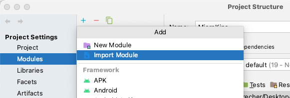

# MicroKino
Mobile Computing 2 Projekt WiSe2022 von Danny Steinbrecher und Christian Harders


## Projekt Struktur
Um die einzelnen Services in IntelliJ direkt aus dem Main-Projekt (MikroKino)  zu benutzen, müssen diese als Modul geladen werden. Dazu muss ein neues Modul in den Projekteinstellungen hinzugefügt werden:





## GitHub Action Workflow

[//]: # (### Environment Variablen)

[//]: # (Um den names des packages an den Workflownamen zu binden, bietet GitHub eigene Environment Variablen an. Mit dem `GITHUB_WORKFLOW` kann der Name, den man dem Workflow gegeben hat, als Packagename benutzt werden. )

[//]: # (https://docs.github.com/en/actions/learn-github-actions/environment-variables)


### Semgrep - Code Smell Check
https://github.com/marketplace/actions/semgrep-action

``` yaml
  semgrep:
    name: Scan
    runs-on: ubuntu-20.04
    container:
      image: returntocorp/semgrep
    steps:
    - uses: actions/checkout@v3
    - run: semgrep ci
 ```


## Pull Package von GitHub Registry
Um das Paackage welches ihr in eure private GitHub Registry deployed habt zu pullen, müsst ihr euch zunächst Authentifizieren. Das erfolgt über den folgenden Befehl

``` bash
  docker login ghcr.io
```

Hierbei werden ihr aufgefordert einen Usernamen und ein Passwort einzugeben. Für das Passswort benötigt ihr einen Personal Access Token. Diesen könnt Ihr euch unter eruem Account anlegen.


Danach könnt Ihr das Package pullen:

``` bash
  docker pull ghcr.io/<namespace>/<package-name>
```


## Naming Conventions

### Namespace
- de.fherfurt.xxx

### Service
#### PackageName
- cinemaservice
- movieservice

#### Modelname
- Cinema
- Movie

#### Reponame
- CinemaRepository
- MovieRepository

#### Applicationname
- CinemaServiceApplication
- MovieServiceApplication

#### Controller
- CinemaServiceController
